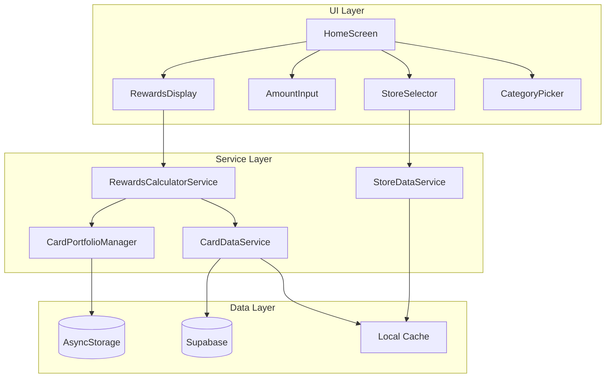

# Design Document: Rewards Value Calculator

## Overview

The Rewards Value Calculator simplifies the HomeScreen to a single-purpose tool that calculates and compares credit card rewards for a specific purchase. The design leverages existing services (CardDataService, CardPortfolioManager, StoreDataService) while introducing a new RewardsCalculatorService for the core calculation logic.

The calculator follows a simple flow:
1. User selects a store (or manual category)
2. User enters purchase amount
3. App displays all portfolio cards with calculated rewards, sorted by CAD value

## Architecture



## Components and Interfaces

### RewardsCalculatorService

New service responsible for calculating rewards across all portfolio cards.

```typescript
interface RewardCalculationResult {
  cardId: string;
  cardName: string;
  issuer: string;
  rewardProgram: string;
  rewardCurrency: RewardType;
  pointsEarned: number;
  cadValue: number;
  multiplierUsed: number;
  isBaseRate: boolean;
  annualFee: number;
  pointValuation: number; // in CAD cents
}

interface CalculatorInput {
  category: SpendingCategory;
  amount: number; // in CAD dollars
  portfolioCardIds: string[];
}

interface CalculatorOutput {
  results: RewardCalculationResult[];
  bestCard: RewardCalculationResult | null;
  category: SpendingCategory;
  amount: number;
}

// Core calculation function
function calculateRewards(input: CalculatorInput): CalculatorOutput;

// Get applicable multiplier for a card and category
function getApplicableMultiplier(card: Card, category: SpendingCategory): number;

// Convert points to CAD value
function pointsToCad(points: number, pointValuation: number): number;
```

### StoreSelector Component

Enhanced store selection with search and category fallback.

```typescript
interface StoreSelectorProps {
  onStoreSelect: (store: Store) => void;
  onCategorySelect: (category: SpendingCategory) => void;
  selectedStore: Store | null;
  selectedCategory: SpendingCategory | null;
}
```

### AmountInput Component

Currency input with validation.

```typescript
interface AmountInputProps {
  value: number | null;
  onChange: (amount: number | null) => void;
  error: string | null;
}
```

### RewardsDisplay Component

Displays calculated rewards for all cards.

```typescript
interface RewardsDisplayProps {
  results: RewardCalculationResult[];
  bestCard: RewardCalculationResult | null;
  isLoading: boolean;
  isEmpty: boolean;
}
```

### CardRewardItem Component

Individual card reward display row.

```typescript
interface CardRewardItemProps {
  result: RewardCalculationResult;
  isBestValue: boolean;
  onPress: () => void;
}
```

## Data Models

### Extended Card Type (for calculator)

The existing Card type from `types/index.ts` is sufficient. The calculator will use:

```typescript
// From existing types
interface Card {
  id: string;
  name: string;
  issuer: string;
  rewardProgram: string;
  baseRewardRate: RewardRate;
  categoryRewards: CategoryReward[];
  annualFee?: number;
}

// From database (via CardDataService)
// point_valuation: number (CAD cents per point)
```

### Calculator State

```typescript
interface CalculatorState {
  selectedStore: Store | null;
  selectedCategory: SpendingCategory | null;
  amount: number | null;
  amountError: string | null;
  results: RewardCalculationResult[];
  bestCard: RewardCalculationResult | null;
  isCalculating: boolean;
  showCategoryPicker: boolean;
}
```

### Reward Type Display Mapping

```typescript
const REWARD_TYPE_LABELS: Record<RewardType, string> = {
  [RewardType.CASHBACK]: 'Cash Back',
  [RewardType.POINTS]: 'Points',
  [RewardType.AIRLINE_MILES]: 'Miles',
  [RewardType.HOTEL_POINTS]: 'Hotel Points',
};

const REWARD_TYPE_ICONS: Record<RewardType, string> = {
  [RewardType.CASHBACK]: 'cash',
  [RewardType.POINTS]: 'star',
  [RewardType.AIRLINE_MILES]: 'plane',
  [RewardType.HOTEL_POINTS]: 'hotel',
};
```


## Correctness Properties

*A property is a characteristic or behavior that should hold true across all valid executions of a system—essentially, a formal statement about what the system should do. Properties serve as the bridge between human-readable specifications and machine-verifiable correctness guarantees.*

### Property 1: Store Search Returns Matching Results

*For any* search query string, all stores returned by the search function should have names or aliases that match the query (case-insensitive partial match).

**Validates: Requirements 1.2**

### Property 2: Store Selection Yields Correct Category

*For any* store selected from the database, the category returned by the calculator should exactly match the store's category field.

**Validates: Requirements 1.3**

### Property 3: Manual Category Selection Used in Calculations

*For any* manually selected spending category, the reward calculations should use that category's multipliers for all cards.

**Validates: Requirements 2.2**

### Property 4: Valid Amount Acceptance

*For any* positive numeric value, the amount input should accept it without validation errors.

**Validates: Requirements 3.1**

### Property 5: Currency Formatting

*For any* valid numeric amount, the formatted output should match the pattern "$X.XX" with exactly two decimal places.

**Validates: Requirements 3.2**

### Property 6: Invalid Amount Rejection

*For any* invalid input (negative numbers, zero, or non-numeric strings), the calculator should return a validation error.

**Validates: Requirements 3.3**

### Property 7: Complete Portfolio Processing with Sorting

*For any* card portfolio and valid calculation input, the results should contain exactly one entry per portfolio card, sorted by CAD value in descending order.

**Validates: Requirements 4.1, 4.5**

### Property 8: Correct Multiplier Selection

*For any* card and spending category combination, the calculator should use the category-specific multiplier if one exists, otherwise the base reward rate.

**Validates: Requirements 4.2**

### Property 9: Points Calculation Correctness

*For any* purchase amount and multiplier, the points earned should equal: `amount × multiplier`.

**Validates: Requirements 4.3**

### Property 10: CAD Value Calculation Correctness

*For any* points earned and point valuation (in cents), the CAD value should equal: `points × (point_valuation / 100)`.

**Validates: Requirements 4.4**

### Property 11: Reward Display Contains Required Fields

*For any* calculation result, the display output should contain: card name, issuer, reward amount with unit, and CAD value.

**Validates: Requirements 5.1**

### Property 12: Reward Amount Formatting

*For any* reward calculation result, the reward earned should be formatted as "[amount] [reward_type]" (e.g., "150 Aeroplan Miles").

**Validates: Requirements 5.2**

### Property 13: CAD Value Formatting

*For any* CAD value, the formatted output should match the pattern "$X.XX CAD".

**Validates: Requirements 5.3**

### Property 14: Best Value Badge Assignment

*For any* non-empty calculation results, the card with the highest CAD value should be marked as "Best Value".

**Validates: Requirements 5.5**

### Property 15: Annual Fee Display

*For any* card with a non-zero annual fee, the display should show "Annual fee: $X" with the correct amount.

**Validates: Requirements 6.1**

## Error Handling

### Input Validation Errors

| Error Condition | Error Message | Recovery Action |
|----------------|---------------|-----------------|
| Empty amount | "Please enter a purchase amount" | Focus amount input |
| Negative amount | "Amount must be positive" | Clear input, focus |
| Zero amount | "Amount must be greater than zero" | Clear input, focus |
| Non-numeric input | "Please enter a valid number" | Clear input, focus |

### Data Errors

| Error Condition | Error Message | Recovery Action |
|----------------|---------------|-----------------|
| Empty portfolio | "Add cards to your portfolio to see rewards" | Show link to My Cards |
| No card data | "Unable to load card data" | Retry button, use cache |
| Store not found | "Store not found" | Show category picker |

### Network Errors

| Error Condition | Error Message | Recovery Action |
|----------------|---------------|-----------------|
| Offline | "You're offline. Using cached data." | Continue with cache |
| Fetch failed | "Unable to refresh data" | Use cached data |

## Testing Strategy

### Unit Tests

Unit tests should cover:
- Amount validation edge cases (boundary values, special characters)
- Currency formatting with various decimal places
- Store search with special characters and unicode
- Empty portfolio handling
- Zero annual fee display

### Property-Based Tests

Property-based tests will use **fast-check** library for TypeScript/JavaScript.

Each property test should:
- Run minimum 100 iterations
- Reference the design document property number
- Tag format: **Feature: rewards-value-calculator, Property {number}: {property_text}**

Key property tests:
1. **Points calculation**: Generate random amounts and multipliers, verify formula
2. **CAD value calculation**: Generate random points and valuations, verify formula
3. **Sorting**: Generate random results, verify descending order by CAD value
4. **Multiplier selection**: Generate cards with/without category bonuses, verify correct selection
5. **Formatting**: Generate random values, verify output patterns

### Integration Tests

- Full calculation flow from store selection to results display
- Cache behavior (fresh data, stale data, offline)
- Portfolio changes reflected in calculations

### Test Configuration

```typescript
// fast-check configuration
fc.configureGlobal({
  numRuns: 100,
  verbose: true,
});
```
