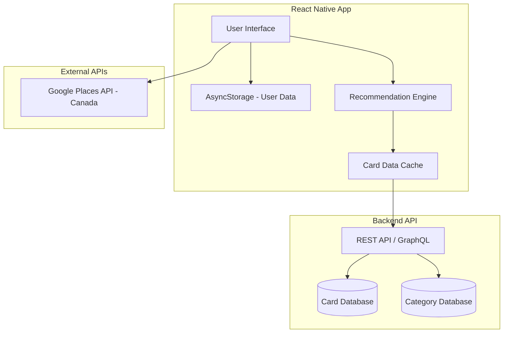
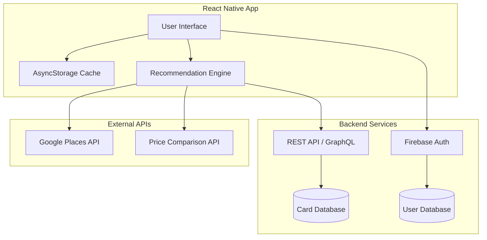

# Design Document: Rewardly (Canada)

## Overview

Rewardly is a mobile application targeting the **Canadian market** that helps users maximize credit card rewards through intelligent recommendations. Users manually add their credit cards from a curated Canadian card database, and the system analyzes store categories and product prices to suggest the optimal card for any purchase.

The application follows a hybrid architecture with a React Native mobile frontend, local data storage for MVP, and optional cloud sync via Firebase. The recommendation engine runs locally using bundled Canadian credit card data and integrates with Google Places API for merchant categorization.

**Target Market:** Canada
**Languages:** English, French (Quebec)

## Architecture

### MVP Architecture (With Backend Database)



### Future Architecture (With User Sync)



## Architectural Decisions

### 1. Manual Card Entry (No Plaid)
Users manually select their credit cards from our Canadian card database. This approach:
- Eliminates Plaid costs (~$500-2000/month)
- Avoids complexity of bank linking
- Works for all Canadian cards regardless of bank support
- Simpler privacy model (no bank credentials)

### 2. Backend Database for Card Data
All credit card and rewards information is stored in a Supabase database:
- Centralized data management and updates
- No app release required for card data changes
- **Populated by a separate scraper application** (different codebase)
- Mobile app only reads card data, never writes
- Cached locally for offline access

### 3. Local-First Storage for User Data
User portfolios and preferences stored locally via AsyncStorage:
- Zero backend costs for user data storage
- Works offline
- Fast performance
- Upgrade path to Firebase for cross-device sync

### 4. Google Places for Merchant Categorization
Google Places API provides:
- Comprehensive Canadian store coverage
- Accurate category classification
- Bilingual support (English/French)
- $200 USD/month free tier

### 5. Deferred Price Comparison
Price comparison feature deferred to Phase 2:
- Reduces MVP complexity
- Focus on core card recommendation value
- Add when user demand is validated

## Components and Interfaces

### CardDataService
Fetches credit card data from the backend database with local caching.

```typescript
interface CardDataService {
  getAllCards(): Promise<Card[]>;
  getCardByKey(cardKey: string): Promise<Card | null>;
  getCardsByIssuer(issuer: CanadianIssuer): Promise<Card[]>;
  getCardsByRewardProgram(program: CanadianRewardProgram): Promise<Card[]>;
  searchCards(query: string): Promise<Card[]>;
  getCardsForCategory(category: SpendingCategory): Promise<Card[]>;
  refreshCards(): Promise<void>;
  getLastSyncTime(): Date | null;
}
```

### CardPortfolioManager
Manages the user's collection of credit cards stored locally.

```typescript
interface CardPortfolioManager {
  addCard(cardKey: string): Result<UserCard, PortfolioError>;
  removeCard(cardKey: string): Result<void, PortfolioError>;
  getCards(): UserCard[];
  getCardById(cardKey: string): UserCard | null;
  isDuplicate(cardKey: string): boolean;
  clearPortfolio(): void;
}
```

### PreferenceManager
Handles user preferences including reward type selection.

```typescript
interface PreferenceManager {
  setRewardTypePreference(type: RewardType): void;
  getRewardTypePreference(): RewardType;
  setNewCardSuggestionsEnabled(enabled: boolean): void;
  isNewCardSuggestionsEnabled(): boolean;
  setLanguage(lang: "en" | "fr"): void;
  getLanguage(): "en" | "fr";
}
```

### MerchantService
Handles merchant lookup via Google Places API.

```typescript
interface MerchantService {
  searchMerchant(query: string): Promise<Result<Merchant[], MerchantError>>;
  getMerchantCategory(merchant: Merchant): SpendingCategory;
  getNearbyMerchants(lat: number, lng: number, category?: SpendingCategory): Promise<Result<Merchant[], MerchantError>>;
}
```

### RecommendationEngine
Core logic that calculates optimal card choices.

```typescript
interface RecommendationEngine {
  getStoreRecommendation(storeName: string, portfolio: UserCard[], preferences: UserPreferences): Promise<StoreRecommendation>;
  rankCardsForCategory(category: SpendingCategory, cards: Card[], rewardType: RewardType): RankedCard[];
  findBetterCards(category: SpendingCategory, userBestCard: Card, rewardType: RewardType): Card[];
  calculateRewardValue(amount: number, card: Card, category: SpendingCategory): RewardValue;
}
```

## Data Models

### Core Entities

```typescript
enum RewardType {
  CASHBACK = "cashback",
  POINTS = "points",
  AIRLINE_MILES = "airline_miles",
  HOTEL_POINTS = "hotel_points"
}

enum SpendingCategory {
  GROCERIES = "groceries",
  DINING = "dining",
  GAS = "gas",
  TRAVEL = "travel",
  DRUGSTORES = "drugstores",
  ENTERTAINMENT = "entertainment",
  ONLINE_SHOPPING = "online",
  HOME_IMPROVEMENT = "home",
  TRANSIT = "transit",
  RECURRING = "recurring",
  OTHER = "other"
}

interface Card {
  cardKey: string;
  name: string;
  nameFr?: string;
  issuer: CanadianIssuer;
  rewardProgram: CanadianRewardProgram;
  rewardCurrency: RewardType;
  pointValuation: number;
  annualFee: number;
  baseRewardRate: number;
  categoryRewards: CategoryReward[];
  signupBonus?: SignupBonus;
  imageUrl?: string;
}

interface CategoryReward {
  category: SpendingCategory;
  multiplier: number;
  description: string;
  descriptionFr?: string;
  hasSpendLimit?: boolean;
  spendLimit?: number;
}
```

## Database Schema (Supabase)

```sql
CREATE TABLE cards (
  id UUID PRIMARY KEY,
  card_key VARCHAR(100) UNIQUE NOT NULL,
  name VARCHAR(200) NOT NULL,
  name_fr VARCHAR(200),
  issuer VARCHAR(100) NOT NULL,
  reward_program VARCHAR(100) NOT NULL,
  reward_currency VARCHAR(50) NOT NULL,
  point_valuation DECIMAL(4,2) NOT NULL,
  annual_fee DECIMAL(8,2) NOT NULL,
  base_reward_rate DECIMAL(4,2) NOT NULL,
  image_url VARCHAR(500),
  is_active BOOLEAN DEFAULT true,
  updated_at TIMESTAMP DEFAULT NOW()
);

CREATE TABLE category_rewards (
  id UUID PRIMARY KEY,
  card_id UUID REFERENCES cards(id),
  category VARCHAR(50) NOT NULL,
  multiplier DECIMAL(4,2) NOT NULL,
  description VARCHAR(500) NOT NULL,
  description_fr VARCHAR(500),
  has_spend_limit BOOLEAN DEFAULT false,
  spend_limit DECIMAL(10,2)
);

CREATE TABLE signup_bonuses (
  id UUID PRIMARY KEY,
  card_id UUID REFERENCES cards(id),
  bonus_amount INTEGER NOT NULL,
  spend_requirement DECIMAL(10,2) NOT NULL,
  timeframe_days INTEGER NOT NULL,
  valid_until DATE,
  is_active BOOLEAN DEFAULT true
);
```

## Privacy & Compliance

### PIPEDA Compliance (Canada)
- Collect only necessary data (card selections, preferences)
- No bank credentials or financial account access
- Provide data export and deletion capabilities
- Clear privacy policy in English and French

### Data Stored Locally
- Card portfolio (card keys only)
- User preferences
- Cached store lookups (7-day TTL)

### Data NOT Stored
- Bank credentials
- Transaction history
- Personal financial information

---

*Target Market: Canada*
*Languages: English, French*
